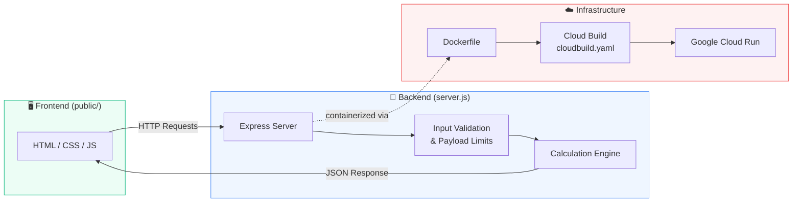

# 🌱 EcoStep — Carbon Footprint Tracker

EcoStep is an interactive carbon footprint tracking and reduction application. It empowers individuals to log everyday activities across travel, energy, food, and waste, understand their environmental impact, receive AI-driven eco-coaching, and commit to personalized pledges and challenges on their path toward a lower carbon footprint.

---

## 🚀 Deployed URL

Live Production Link: https://carbon-footprint-tracker-369987229127.us-central1.run.app/

---

## 📊 Project Architecture & Workflow

### User Interaction Flow

The following flowchart illustrates how user inputs propagate through the calculation engine, update active dashboard metrics, and feed into the pledges and action plan system to produce real footprint reductions:

```mermaid
flowchart TD
    A[User Input Form] -->|React State Update| B[Carbon Calculation Engine]
    A -->|Render Live Path Chart| C[Comparative SVG Target Chart]

    B -->|Compute Category Totals| D[Dashboard Canvas]
    E[Active Pledges List] -->|Update Active Footprint| D

    D -->|Render SVG Donut Chart| F[Category Breakdowns]
    D -->|Calculate Forest Offset & Aviation Equivs| G[Equivalency Stats]

    H[Action Plan Scheduler] -->|Insert Custom Target Pledges| E
    E -->|Mark Checklist Done| I[Deduct Carbon Savings]
    I -->|Update Active Footprint| D

    J[Pledges] --> H

    classDef process fill:#1e293b,stroke:#cbd5e1,stroke-width:1.5px,color:#fff

    class A,B,C,D,E,F,G,H,I,J process


     

```

### System Architecture



---

## ✨ Features

- 📊 **Interactive Estimate Forms** — log travel, energy, food, and waste activities
- 🤖 **AI Eco-Coaching** — personalized reduction tips based on your footprint data
- 🏗️ **Habit Builder** — track and build sustainable daily habits
- 🛒 **Offset Marketplace** — explore carbon offset options
- 🎯 **Pledges & Action Plan Scheduler** — set custom target pledges and track checklist progress
- 📈 **Live Charts** — SVG donut breakdowns, comparative target charts, and equivalency stats (forest offset, aviation equivalents)

---

## 🛠️ Local Development

1. **Install dependencies**
```bash
   npm install
```

2. **Run the app**
```bash
   npm start
```

3. **Open in browser**

## GCP Deployment

The project includes a `Dockerfile` and `cloudbuild.yaml`.

1. Build and push with Cloud Build:
   ```bash
   gcloud builds submit --config cloudbuild.yaml .
   ```
2. Deploy to Cloud Run:
   ```bash
   gcloud run deploy carbon-footprint-tracker \
     --image gcr.io/$PROJECT_ID/carbon-footprint-tracker:$SHORT_SHA \
     --platform managed \
     --region us-central1 \
     --allow-unauthenticated \
     --port 8080
   ```

## Notes for Quality and Safety

- Uses Express with `x-powered-by` disabled.
- Validates inputs and protects against large JSON payloads.
- Implements modular frontend structure with storage, calculations, and UI separated.
- Includes both calculation engine and server API tests.


## ☁️ GCP Deployment

The project includes a `Dockerfile` and `cloudbuild.yaml` for Cloud Run deployment.

1. **Build and push with Cloud Build**
```bash
   gcloud builds submit --config cloudbuild.yaml .
```

2. **Deploy to Cloud Run**
```bash
   gcloud run deploy carbon-footprint-tracker \
     --image gcr.io/$PROJECT_ID/carbon-footprint-tracker:$SHORT_SHA \
     --platform managed \
     --region us-central1 \
     --allow-unauthenticated \
     --port 8080
```

---

## 🔒 Notes on Quality & Safety

- Uses Express with `x-powered-by` disabled
- Validates inputs and protects against large JSON payloads
- Modular frontend structure — storage, calculations, and UI are separated
- Includes both calculation engine and server API tests

---

## 📁 Project Structure
CarbonfootPrint/

├── public/          # Frontend assets (HTML, CSS, JS)

├── tests/           # Calculation + server tests

├── server.js        # Express server entry point

├── Dockerfile        # Container build config

├── cloudbuild.yaml   # GCP Cloud Build pipeline

└── package.json      # Dependencies & scripts

---
